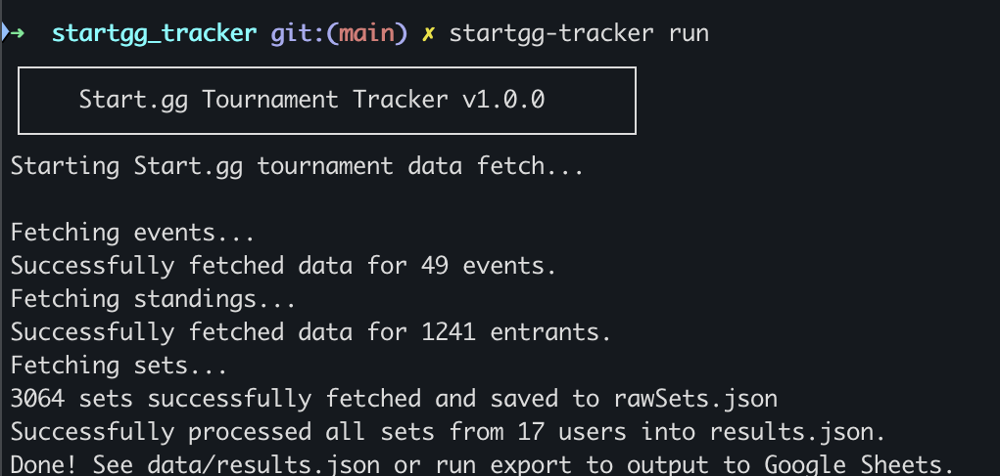
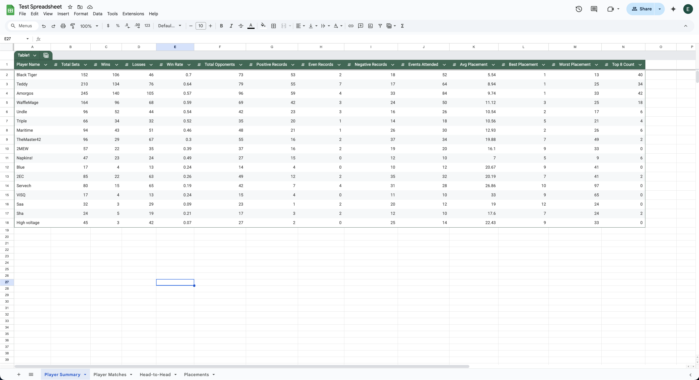
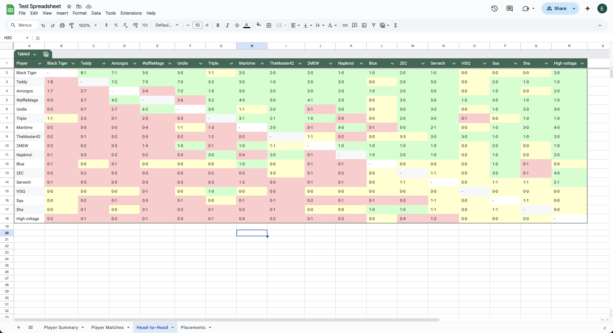

# Start.gg Tournament Tracker


A powerful command-line tool for tracking players and tournaments on start.gg. Automatically fetch, process, and export tournament data including player sets, standings, and event results with seamless Google Sheets integration.

Perfect for tournament organizers, members of local and statewide PR panels, and competitive gaming communities who need automated tracking and professional reporting capabilities.

## Motivation
I initially got the idea for this project from one of my friends at UW-Madison, who also was an officer for the SSBU club there. He mentioned how long generating a PR (power rankings) would take as he would have to manually input match data per player in the club. 

This inspired me to explore how I could help automate the process. After learning that Start.gg offered an API, I began planning a tool that could fetch relevant data automatically. At first, my goal was just to export the data into a JSON file, as this was my first time working with GraphQL and APIs, and I wanted to focus on getting the data right.

As the project evolved, I decided to make it more user-friendly by integrating the Google Sheets API. This allowed me to present the tournament stats in a clean, organized, and familiar format, making it easier for ranking panelists and TOs to review, filter, and analyze results. I also decided to use commander.js to absract the code away and allow a user to run the program solely through a command line. This project was certainly fulfilling and I am glad it is planned to be used at other universities outside of UW as well!


## Features
-   Tournament Management: Add and track dozens of tournaments with ease
-   Player Tracking: Monitor specific players across all tracked tournaments
-   Data Processing: Automatically fetch and process comprehensive tournament data
-   Google Sheets Export: Seamlessly export results to Google Sheets for analysis
-   CLI Interface: Intuitive command-line interface for efficient use
-   Modular Architecture: Extensible codebase for custom features and integrations

## Table of Contents
- [Installation](#installation)
- [Quick Start](#quick-start)
- [Commands Reference](#commands-reference)
- [Configuration](#configuration)
- [Google Sheets Integration](#google-sheets-integration)
- [Development](#development)
- [Contributing](#contributing)
- [License](#license)
- [Roadmap](#roadmap)

## Installation

### Prerequisites

-   Node.js 16.0.0 or higher
-   npm or package manager
-   Start.gg API key (required - obtain from [start.gg developer settings](https://developer.start.gg/docs/authentication))

### Setup

1.  Clone the repository

    ```bash
    git clone https://github.com/erik-larson01/startgg-tracker.git
    cd startgg-tracker
    ```

2.  Install dependencies

    ```bash
    npm install
    ```
3.  Install globally (allows startgg-tacker <command> rather than node startgg-tracker.js <command>)

    ```bash
    npm link
    ```

4.  Set up your Start.gg API key

    ```bash
    startgg-tracker set-api-key "your-api-key-here"
    ```

5. Run the CLI

    You can run commands either by:
    ```bash
    node startgg-tracker.js <command>
    ```

    or, after installing globally:

    ```bash
    startgg-tracker <command>
    ```

## Quick Start

1.  Initialize the project

    ```bash
    startgg-tracker init
    ```

2.  Add players to track

    ```bash
    startgg-tracker add player "PlayerName"
    startgg-tracker add player "AnotherPlayer"
    ```

3.  Add tournaments

    ```bash
    startgg-tracker add tournament "https://start.gg/tournament/your-tournament"
    ```

4.  Fetch and process data

    ```bash
    startgg-tracker run
    ```

5.  Export to Google Sheets (recommended)

    ```bash
    # Run after Google Sheets setup (view Google Sheets integration below)
    startgg-tracker export
    ```

### Commands Reference

| Command | Description | Example |
| --- | --- | --- |
| `init` | Initialize configuration files | `startgg-tracker init` |
| `add-player <gamerTag>` | Add a player to tracking list | `startgg-tracker add-player "Mang0"` |
| `delete-player <gamerTag>` | Remove a tracked player | `startgg-tracker delete-player "Mang0"` |
| `view-players` | Display all tracked players | `startgg-tracker view-players` |
| `add-tournament <url>` | Add tournament URL to tracking | `startgg-tracker add-tournament "https://start.gg/.../event-name"` |
| `delete-tournament <urlOrIndex>` | Remove tournament by URL or index | `startgg-tracker delete-tournament 1` |
| `view-tournaments` | List all tracked tournaments | `startgg-tracker view-tournaments` |
| `set-spreadsheet <id>` | Configure Google Sheets integration | `startgg-tracker set-spreadsheet "1A2B3C..."` |
| `set-api-key <key>` | Set or update Start.gg API key in .env file | `startgg-tracker set-api-key "your-api-key"` |
| `run` | Fetch and process tournament data | `startgg-tracker run` |
| `export` | Export processed data to Google Sheets | `startgg-tracker export` |
| `--help` or `-h` | Display help for all commands | `startgg-tracker --help` |

## Configuration

The tool uses and creates the following directory structure:

-   `config/` - Configuration files directory (created by `init` command)
    -   `players.json` - List of tracked player gamer tags
    -   `tournaments.json` - Start.gg tournament event URLs
    -   `spreadsheetId.txt` - Google Sheets spreadsheet ID for export
-   `data/` - Processed tournament data directory (created during data processing)
    -   `eventData.json` - Raw event information from tournaments
    -   `rawSets.json` - Raw match/set data from tournaments
    -   `results.json` - Processed results data
    -   `standings.json` - Tournament standings data
-   `src/` - Source code modules directory (part of project structure)
    -   Contains the core functionality modules for fetching and processing data
-   `.env` - Environment variables file containing your Start.gg API key

## Google Sheets Integration

### Setup Instructions

1.  Create Google Cloud Project
    -   Visit [Google Cloud Console](https://console.cloud.google.com/)
    -   Go to the navigation menu → "IAM & Admin" → "Create a Project"
    -   Create a new project or select existing one
2.  Enable Google Sheets API
    -   Navigate to "APIs & Services" → "API Library"
    -   Search and enable "Google Sheets API"
3.  Create Service Account
    -   Go to "APIs & Services" → "Credentials"
    -   Click "Create Credentials" → "Service Account"
    -   Complete the setup process
4.  Generate Service Account Key
    -   Select your service account
    -   Go to "Keys" tab → "Add Key" → "JSON"
    -   Download and save as `credentials.json` in project root
5.  Configure Google Sheet Access
    -   Create or open your target Google Sheet
    -   Share with service account email (found in `credentials.json`)
    -   Grant "Editor" permissions
6.  Set Spreadsheet ID
    -   Obtain the spreadsheet ID from the URL (after /d/ and before /edit)
    ```bash
    startgg-tracker set-spreadsheet "your-spreadsheet-id-from-url"
    ```

### Usage

After configuration, export data with:


```bash
startgg-tracker run 
startgg-tracker export
```

The exported Google Sheets file will have multiple tabs representing different views of your tournament data:

| Tab Name         | Description                                              |
|------------------|----------------------------------------------------------|
| **Player Summary** | List of tracked players and their overall stats         |
| **Player Matches** | Compilation of all sets each player played across tournaments |
| **Head-to-Head**   | Player vs Player H2H matchup records                    |
| **Standings**      | Tournament standings per player                         |

You can also view the results in a text format via results.json.

### Running the CLI

Here's what running the tool looks like in your terminal:


After export, here's what two example tabs look like:



## Development

### Tech Stack

-   Runtime: Node.js with ES Modules
-   CLI Framework: Commander.js
-   APIs: Start.gg GraphQL API, Google Sheets RESTful API
-   Configuration: Environment variables via dotenv

### Project Structure

```
startgg-tracker/
├── config/              # Configuration files
│   ├── players.example.json
│   ├── players.json
│   ├── spreadsheetId.txt
│   ├── tournaments.example.json
│   └── tournaments.json
├── data/                # Processed tournament data
│   ├── eventData.example.json
│   ├── eventData.json
│   ├── rawSets.example.json
│   ├── rawSets.json
│   ├── results.example.json
│   ├── results.json
│   ├── standings.example.json
│   └── standings.json
├── src/                 # Source code modules
│   ├── exportResults.js
│   ├── fetchEvents.js
│   ├── fetchSets.js
│   ├── fetchStandings.js
│   ├── googleAuth.js
│   └── processSets.js
├── .env                 # Environment variables
├── .gitignore
├── credentials.json     # Google API credentials
├── package-lock.json
├── package.json
├── README.md
└── startgg-tracker.js   # Main CLI entry point
```

## Contributing

I welcome contributions! Here's how you can help:

1.  Report Issues: Use GitHub Issues for bugs and feature requests
2.  Submit Pull Requests: Fork, create feature branch, and submit PR
3.  Suggest Features: Share ideas for new functionality
4.  Improve Documentation: Help make the docs better

## License

This project is licensed under the MIT License - see the [LICENSE](./LICENSE.txt) file for details.

## Roadmap

### Planned Features

-   Regional Filtering: Filter tournaments by region or game title
-   Advanced Analytics: Performance trends and notable wins
-   Web Interface: Browser-based GUI for easier interaction
-   Automated Updates: Scheduled data fetching (daily/weekly)
-   Database Integration: Support for PostgreSQL/MongoDB for large datasets

### Community Requests

Have an idea? [Open an issue](https://github.com/erik-larson01/startgg_tracker/issues) and let me know!

## Support


-   Issues: [GitHub Issues](https://github.com/erik-larson01/startgg_tracker/issues)
-   Contact: <emlarson23@wisc.edu>

* * * * *

Made with ❤️ for the competitive gaming community

[⭐ Star this repository](https://github.com/erik-larson01/startgg_tracker) if you find it useful!
